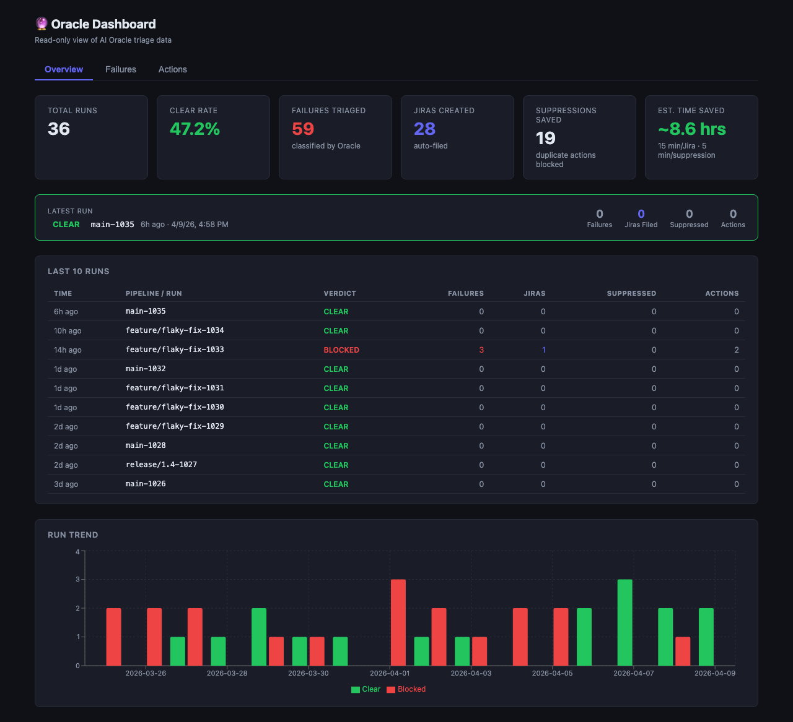
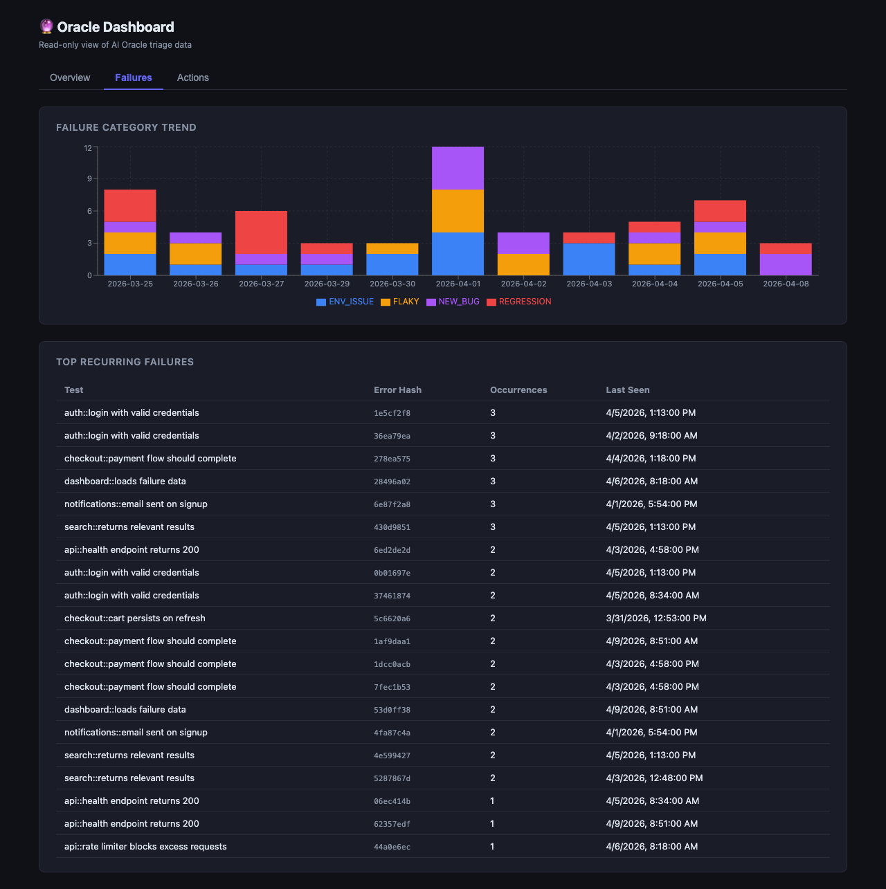
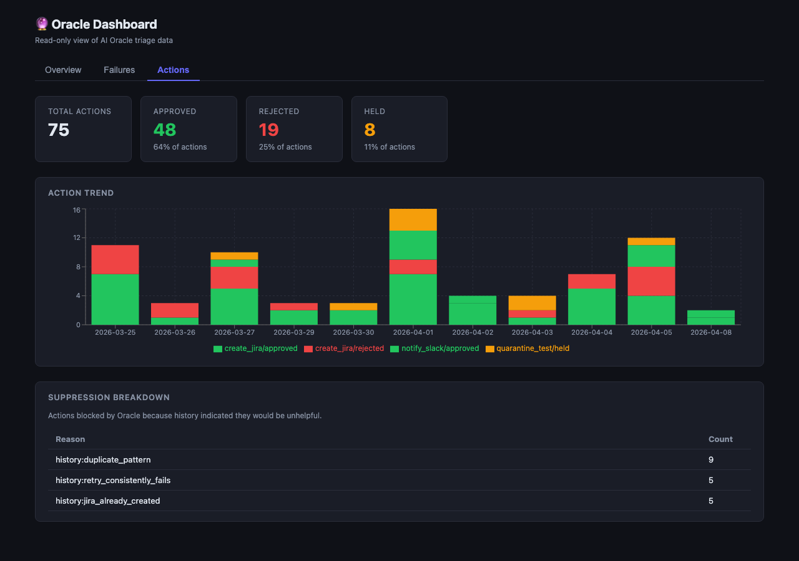

# AI Oracle

**Autonomous test failure triage for GitLab CI and GitHub Actions.**

Oracle runs automatically after your pipeline fails. It reads the test report,
classifies every failure using Claude, opens Jira defects for regressions and
new bugs, posts a Slack summary, and writes a human-readable decision log — all
before anyone on your team has opened a browser tab.

---

## Dashboard

Oracle ships with a read-only dashboard for monitoring triage activity, failure trends, and the value Oracle has delivered over time.

### Overview


Stat cards show total runs, clear rate, failures triaged, Jiras auto-filed, suppressions saved, and estimated time saved. The **Latest Run** panel shows the most recent pipeline verdict at a glance, and the **Last 10 Runs** table gives a compact audit trail with per-run action counts.

### Failures


Stacked bar chart shows failure volume by category (FLAKY / REGRESSION / ENV_ISSUE / NEW_BUG) over time. The **Top Recurring Failures** table surfaces the noisiest tests by occurrence count.

### Actions


Verdict summary cards show the total action breakdown (approved / rejected / held). The stacked trend chart shows action volume by type and verdict over time. The **Suppression Breakdown** table shows which history rules are blocking the most duplicate actions.

### Running the dashboard

```bash
# Seed a local dev database with 14 days of realistic dummy data
npm run db:seed

# Start the API server (port 3000) against the seeded DB
npm run dashboard:dev-seed

# Start the Vite dev server (port 5173) in a second terminal
npm run dashboard:ui
# → open http://localhost:5173
```

---

## Why this exists

Every failed pipeline triggers the same manual loop:

1. Engineer sees a red build notification
2. Opens CI logs, scrolls past noise to find failures
3. Decides: is this flaky? A real regression? A missing feature? An env problem?
4. If real: opens a Jira ticket, notifies the team on Slack
5. If flaky: re-triggers the pipeline and moves on

That loop takes **15–30 minutes per incident** even for experienced engineers,
and it happens at the worst possible time — just before a release or during an
active sprint.

Oracle eliminates steps 2–4 completely for the majority of failures.

---

## What it does

```
Pipeline fails
     │
     ▼
Oracle job triggers (when: on_failure)
     │
     ├─ Parses test report (Playwright JSON / JUnit XML / pytest JSON)
     │
     ├─ Sends each failure to Claude for classification
     │    └─ category (FLAKY | REGRESSION | ENV_ISSUE | NEW_BUG)
     │    └─ confidence score (0–1)
     │    └─ one-line reasoning
     │    └─ suggested fix
     │
     ├─ Policy engine decides actions (deterministic rules, not the LLM)
     │    ├─ REGRESSION / NEW_BUG + confidence > 0.7  →  open Jira defect
     │    ├─ Fingerprint already exists in DB          →  skip duplicate Jira
     │    └─ Every run                                 →  post Slack summary
     │
     ├─ Writes oracle-decision-summary.md (CI artifact, PR comment)
     ├─ Writes oracle-verdict.json (CLEAR / BLOCKED / DEGRADED + per-failure stats)
     └─ Persists run to SQLite for pattern learning
```

The LLM **only classifies**. Every action decision belongs to the policy engine,
which applies deterministic rules and logs every decision with its full audit
context. This separation means classification accuracy and action safety can be
improved independently.

---

## ROI

### Time saved per engineer

| Scenario | Manual triage | With Oracle | Saving |
|---|---|---|---|
| 1 flaky test identified | ~15 min | ~0 min (auto-classified, no Jira) | **15 min** |
| 1 regression found, Jira opened | ~25 min | ~0 min (auto-classified, Jira auto-created) | **25 min** |
| 5 mixed failures in one pipeline run | ~60–90 min | ~0 min | **60–90 min** |
| Duplicate Jira avoided (seen before) | ~10 min to check history | 0 (DB dedup) | **10 min** |

For a team with **3–5 pipeline failures per day**, Oracle typically saves **1–2
hours of engineering time daily** — without counting the context-switch cost of
being pulled away from focused work.

### API cost per triage run

Oracle uses **claude-sonnet-4-6** and batches up to 10 failures per API call.

| Failures per run | Approx input tokens | Approx output tokens | Approx cost |
|---|---|---|---|
| 1 failure | ~700 | ~150 | ~$0.004 |
| 5 failures | ~1,800 | ~500 | ~$0.013 |
| 10 failures | ~3,200 | ~900 | ~$0.023 |
| 20 failures (2 batches) | ~6,400 | ~1,800 | ~$0.046 |

> Token estimates are based on the system prompt (~400 tokens), per-failure
> error payloads capped at 800 characters each, and observed output sizes from
> local experiment runs. Pricing based on Claude claude-sonnet-4-6 published rates.
> Your actual cost will vary with error message length and instinct context size.

**A team running 100 triage jobs per month at an average of 5 failures each
pays approximately $1.30/month in API costs** — less than a coffee.

### Classification accuracy

> **Evaluation status:** accuracy numbers below come from synthetic test
> fixtures (`fixtures/experiment/`) that were hand-crafted to represent each
> category unambiguously.  They are a sanity-check on prompt quality, not a
> measurement of real-world precision or recall.  No evaluation has been run
> against a labelled production dataset.

| Category | Observed confidence (synthetic fixtures) | Notes |
|---|---|---|
| `FLAKY` | ≥ 80% | Timeout, selector instability, retry patterns |
| `REGRESSION` | ≥ 90% | Value mismatches on known-working endpoints |
| `ENV_ISSUE` | ≥ 95% | `ERR_CONNECTION_REFUSED`, `CERT_HAS_EXPIRED` |
| `NEW_BUG` | ≥ 90% | 404 on feature-flagged / never-implemented paths |
| Ambiguous | — | Oracle picks the most likely category; flagged in output |

Real-world accuracy depends on error message quality, test name clarity, and
how representative the fixtures are of your specific test suite.  The numbers
above should be treated as a starting baseline, not a performance guarantee.

Accuracy on *your* failures improves over time via the **instinct system** —
patterns seen 3+ times with consistent classification (confidence > 0.7) are
written to `.instincts/` and injected into the prompt on future runs.

---

## How it works

### Operating modes

Oracle evaluates three modes in priority order on every run:

| Mode | Trigger | Purpose |
|---|---|---|
| **Feedback ingestion** | `ORACLE_FEEDBACK_PATH` set | Ingest operator feedback (Jira outcomes, corrections) into SQLite. No API key required. |
| **Agent proposal** | `ORACLE_AGENT_PROPOSALS_PATH` set | Process action proposals from AI sub-agents through the same policy engine. No API key required. |
| **Normal CI triage** | Neither path set | Full triage: parse report → classify → propose and execute actions → post Slack + PR comment. |

### Separation of concerns

The LLM **only classifies** — it outputs a category, confidence score,
reasoning, and suggested fix for each failure. It does not decide whether to
open a Jira ticket.

That decision belongs to the **policy engine** (`src/policy-engine.ts`), which
applies deterministic rules and persists every decision with its full audit
context to the `actions` table. This means you can tune action thresholds
without touching the classification logic, and vice versa.

**Agents are never trusted executors.** Agent proposals flow through the same
policy engine as policy-generated actions. Every proposal is recorded in
`agent_proposals` and linked to the shared `actions` ledger regardless of
verdict (approved, held, or rejected).

### Failure categories

The LLM must classify every failure as exactly one of these four values. The
schema is enforced at runtime — any other value is rejected before reaching the
policy engine.

| Category | Meaning | Typical action |
|---|---|---|
| `FLAKY` | Timing issue, race condition, or transient network error | Retry (if agent proposes); no Jira |
| `REGRESSION` | Genuine change in app behaviour or API contract break | Jira defect (confidence > 0.7) |
| `ENV_ISSUE` | CI environment problem — certificate error, proxy, missing service | Slack alert; no Jira |
| `NEW_BUG` | Previously unseen failure — feature missing or never implemented | Jira defect (confidence > 0.7) |

To add a category: add it to `TriageCategory` in `src/types.ts`. The Zod schema
in `src/schemas.ts` picks it up automatically via `z.nativeEnum(TriageCategory)`.

### Deduplication

Oracle fingerprints every action (category + test name + error hash). If the
same failure pattern has already produced a Jira ticket in a previous run, the
`create_jira` action is rejected automatically — no duplicate tickets within
the same restored cache scope.

**Scope of deduplication:** the check reads from the SQLite state DB that is
restored from the GitHub Actions cache (`oracle-state-${{ repository_id }}-`).
This cache is per-repository and carries forward history across sequential runs.
Concurrent runs that start before any run has saved its cache will not see each
other's newly created Jiras — they share history up to the last saved cache
snapshot but not in-flight state.

The dedup table also detects when previous Jiras were closed as duplicates
(`jira_duplicates ≥ 2`) and suppresses further filing for that pattern.

---

## Jira integration

Oracle creates one Jira defect per unique failure pattern when:
- Category is `REGRESSION` or `NEW_BUG`
- Confidence score exceeds 0.7
- No existing open ticket for this fingerprint exists in the `actions` ledger

The defect includes the test name, error category, confidence score, reasoning,
and suggested fix from the LLM. Defects are created via the Jira REST API using
your `ATLASSIAN_TOKEN`.

---

## Slack integration

A Slack summary is posted after every triage run regardless of verdict. It
includes:
- Overall verdict (`CLEAR` or `BLOCKED`)
- Failure count by category
- Any history-influenced decisions (e.g. "Jira suppressed — duplicate pattern")

---

## Agent proposal types

Agent proposals must use one of these `proposal_type` values. Any other value
is rejected at intake before reaching the policy engine.

| Type | Meaning |
|---|---|
| `retry_test` | Request a test re-run. Approved/held/rejected based on confidence and retry history. |
| `request_human_review` | Flag for operator review. Always approved (low-risk acknowledgement). |

To add a proposal type: add it to `AGENT_PROPOSAL_TYPES` in `src/schemas.ts`,
add a handler in `decideAgentProposal()` in `src/policy-engine.ts`, and add an
executor in `src/index.ts` if the action has a side effect.

### LLM output fields — reasoning and suggested_fix

Both `reasoning` and `suggested_fix` are **required** on every result item. The
schema enforces their presence; if the LLM omits either field the entire batch
is rejected before reaching the policy engine.

An empty string (`""`) is valid — the LLM may have nothing concrete to add for
a trivially obvious failure. What is not acceptable is the field being absent
entirely, which indicates a structural prompt regression. This design keeps
null-guard logic out of all downstream consumers (decision explainer, Slack
notifier, summary writer).

### Structured logging

Validation and ingestion paths emit structured log lines in `key=value` format:

```
[oracle:<module>] <event>  key=value key=value
```

Examples:

```
[oracle:agent-proposal-loader] proposal.rejected  reason=schema_validation issues="proposal_type: must be one of retry_test, request_human_review"
[oracle:agent-proposal-loader] proposal.throttled  reason=max_per_source_exceeded limit=20 source=flaky-detector-v1 test_name="Login > redirect"
[oracle:feedback-processor] feedback.rejected  reason=invalid_or_unknown_type feedback_type=bad_type
[oracle:triage] batch.rejected  reason=schema_validation details="LLM response failed schema validation: ..."
```

These lines are:
- **Human-readable** in CI terminal output
- **Parseable** by log aggregators (Datadog, Splunk, CloudWatch Insights)
- **Safe**: field values are truncated at 200 characters — raw LLM payloads are never echoed in full

---

## Supported report formats

Oracle auto-detects the format from the file extension and content:

| Format | Detection | Covers |
|---|---|---|
| Playwright JSON | `.json` with `suites` key | Playwright E2E and API tests |
| JUnit XML | `.xml` extension | Java/REST Assured, C#/NUnit, Python/pytest, any xUnit tool |
| pytest JSON | `.json` with `tests[].nodeid` | Python pytest with `--json-report` |

Override detection with the `REPORT_FORMAT` environment variable:
```
REPORT_FORMAT=JUNIT_XML
REPORT_FORMAT=PLAYWRIGHT_API
REPORT_FORMAT=PYTEST_JSON
REPORT_FORMAT=PLAYWRIGHT_JSON
```

---

## Quick start

### GitLab CI

In your consuming repo's `.gitlab-ci.yml`:

```yaml
stages:
  - test
  - e2e
  - oracle     # add after your test stage
  - deploy

include:
  - project: your-group/ai-oracle
    ref: main
    file: oracle-stage.yml

oracle-triage:
  extends: .oracle-triage
  needs:
    - job: your-e2e-job
      artifacts: true
  variables:
    PLAYWRIGHT_REPORT_PATH: test-results/
```

Add variables in **Settings → CI/CD → Variables**:

| Variable | Description | Protected | Masked |
|---|---|---|---|
| `ANTHROPIC_API_KEY` | Claude API key | yes | yes |
| `ATLASSIAN_TOKEN` | Jira API token | yes | yes |
| `ATLASSIAN_BASE_URL` | e.g. `https://your-org.atlassian.net` | no | no |
| `ATLASSIAN_PROJECT_KEY` | Jira project key e.g. `QA` | no | no |
| `SLACK_WEBHOOK_URL` | Incoming webhook URL | yes | yes |
| `ORACLE_FEEDBACK_PATH` | Path to feedback JSON file (enables feedback ingestion mode) | no | no |
| `ORACLE_AGENT_PROPOSALS_PATH` | Path to agent proposals JSON file (enables agent proposal mode) | no | no |
| `RETRY_COMMAND` | Shell command to execute when a `retry_test` proposal is approved | no | no |
| `ORACLE_MAX_PROPOSALS` | Max total agent proposals per load (default: 100) | no | no |
| `ORACLE_MAX_PROPOSALS_PER_SOURCE` | Max proposals per source_agent per load (default: 20) | no | no |

---

### GitHub Actions

In your consuming repo's workflow file:

```yaml
jobs:
  your-test-job:
    runs-on: ubuntu-latest
    steps:
      - uses: actions/checkout@v4
      - name: Run tests
        run: npx playwright test
      - name: Upload test results
        if: always()
        uses: actions/upload-artifact@v4
        with:
          name: test-results
          path: test-results/

  oracle-triage:
    needs: [your-test-job]
    if: failure()
    uses: your-org/ai-oracle/.github/workflows/oracle-triage.yml@main
    with:
      report-path: test-results/results.json
    secrets:
      anthropic-api-key: ${{ secrets.ANTHROPIC_API_KEY }}
      atlassian-token: ${{ secrets.ATLASSIAN_TOKEN }}
      atlassian-base-url: ${{ secrets.ATLASSIAN_BASE_URL }}
      atlassian-project-key: ${{ secrets.ATLASSIAN_PROJECT_KEY }}
      slack-webhook-url: ${{ secrets.SLACK_WEBHOOK_URL }}
```

The `verdict` output (`CLEAR` or `BLOCKED`) can gate downstream jobs:

```yaml
  deploy:
    needs: [oracle-triage]
    if: needs.oracle-triage.outputs.verdict == 'CLEAR'
    runs-on: ubuntu-latest
    steps:
      - run: echo "Deploy approved — no regressions found"
```

### `oracle-verdict.json` contract

Oracle writes `oracle-verdict.json` after every triage run.  There are two
distinct shapes depending on whether triage succeeded or Oracle itself failed.

**Normal verdict** (triage completed — all failures were classified):

```json
{
  "verdict": "BLOCKED",
  "FLAKY": 1,
  "REGRESSION": 1,
  "NEW_BUG": 0,
  "ENV_ISSUE": 0,
  "failures": [
    {
      "testName": "checkout applies voucher",
      "errorHash": "a3f9c1d2",
      "category": "REGRESSION",
      "confidence": 0.92,
      "pattern_stats": {
        "actionCount": 5,
        "jiraCreatedCount": 3,
        "jiraDuplicateCount": 2,
        "retryPassedCount": 2,
        "retryFailedCount": 1
      }
    }
  ]
}
```

`verdict` is `CLEAR` when all failures are `FLAKY` or `ENV_ISSUE`; `BLOCKED`
when at least one is `REGRESSION` or `NEW_BUG`.

**Degraded verdict** (Oracle itself failed — API error, DB error, parse
failure, etc. — and `triage-failure-mode=pass-through` is set):

```json
{
  "verdict": "DEGRADED",
  "degraded": true,
  "reason": "connect ECONNREFUSED 127.0.0.1:443",
  "FLAKY": 0,
  "REGRESSION": 0,
  "NEW_BUG": 0,
  "ENV_ISSUE": 0
}
```

| Field | Type | Meaning |
|---|---|---|
| `verdict` | `"DEGRADED"` | Oracle failed — not a test classification result |
| `degraded` | `true` | Flag for consumers that need to detect Oracle failures |
| `reason` | `string` | Error message from the caught exception |
| `FLAKY` … `ENV_ISSUE` | `0` | Always zero — no failures were classified |

`DEGRADED` is **not** a category of test failure.  It means the Oracle process
could not complete triage.  The "Determine verdict" workflow step maps it to:
- `CLEAR` when `triage-failure-mode=pass-through` (pipeline not blocked)
- `BLOCKED` when `triage-failure-mode=fail-closed` (pipeline blocked, default)

In `fail-closed` mode no artifact is written — the workflow falls back to
`BLOCKED` when the file is absent.

### Oracle failure modes

Control what happens when Oracle itself fails (API error, DB init failure,
report parse error, etc.):

| Workflow input | Env var | Default | Behavior |
|---|---|---|---|
| `triage-failure-mode: fail-closed` | `ORACLE_TRIAGE_FAILURE_MODE=fail-closed` | ✓ | Oracle exits 1 → triage job fails → downstream deploy gates are blocked |
| `triage-failure-mode: pass-through` | `ORACLE_TRIAGE_FAILURE_MODE=pass-through` | | Oracle writes DEGRADED artifact and exits 0 → downstream deploy gates see `verdict=CLEAR` and are not blocked |

**Default is `fail-closed`** — this is the safe choice for teams gating deploys
on Oracle's verdict.  Use `pass-through` only when Oracle is informational and
you do not want CI to be blocked by Oracle infrastructure failures.

```yaml
oracle-triage:
  uses: your-org/ai-oracle/.github/workflows/oracle-triage.yml@main
  with:
    report-artifact-name: test-results
    triage-failure-mode: pass-through   # optional — informational mode
  secrets:
    anthropic-api-key: ${{ secrets.ANTHROPIC_API_KEY }}
```

Add the same secrets in **Settings → Secrets and variables → Actions**.

Optional variables for feedback and agent proposal modes:

| Variable | Description |
|---|---|
| `ORACLE_FEEDBACK_PATH` | Path to a feedback JSON file — enables feedback ingestion mode |
| `ORACLE_AGENT_PROPOSALS_PATH` | Path to an agent proposals JSON file — enables agent proposal mode |
| `ORACLE_TRIAGE_FAILURE_MODE` | `fail-closed` (default) or `pass-through` — see Oracle failure modes above |
| `RETRY_COMMAND` | Shell command run when an approved `retry_test` proposal executes |
| `ORACLE_MAX_PROPOSALS` | Max total agent proposals per load (default: 100) |
| `ORACLE_MAX_PROPOSALS_PER_SOURCE` | Max proposals per `source_agent` value per load (default: 20) |

---

### Enable the JSON reporter in Playwright

```ts
// playwright.config.ts
reporter: [
  ['html'],
  ['json', { outputFile: 'playwright-report/results.json' }]
]
```

For pytest, run with:
```bash
pytest --json-report --json-report-file=report.json
```

For JUnit (Maven/Gradle/NUnit/etc.), point `PLAYWRIGHT_REPORT_PATH` at the
XML output your tool already produces — no extra configuration needed.

---

## Local development

```bash
# Install dependencies
npm install

# Type check
npm run typecheck

# Run unit tests
npm test

# Dry-run triage against a local report (prints JSON, skips Jira + Slack)
ANTHROPIC_API_KEY=sk-ant-... \
PLAYWRIGHT_REPORT_PATH=./my-report.json \
npm run triage:dry

# Full triage run (requires all env vars)
npm run triage

# Run the local classification experiment (4 fixtures, prints accuracy table)
ANTHROPIC_API_KEY=sk-ant-... ./scripts/run-local-experiment.sh

# Generate instinct files from SQLite history (run after every 5–10 CI runs)
npm run learn

# Ingest operator feedback from a JSON file
ORACLE_FEEDBACK_PATH=./feedback.json npm run triage

# Process agent proposals from a JSON file
ORACLE_AGENT_PROPOSALS_PATH=./proposals.json npm run triage
```

### Local experiment

The experiment script runs Oracle against four synthetic Playwright fixtures —
one per category — and prints a classification accuracy table:

```
Fixture                        Human label            Oracle label           Confidence   Match?
────────────────────────────── ────────────────────── ────────────────────── ──────────── ──────
pw-flaky.json                  FLAKY                  FLAKY                  84%          ✅
pw-regression.json             REGRESSION             REGRESSION             93%          ✅
pw-new-bug.json                NEW_BUG                NEW_BUG                91%          ✅
pw-env-issue.json              ENV_ISSUE              ENV_ISSUE              97%          ✅
pw-ambiguous.json              REGRESSION_or_NEW_BUG  REGRESSION             76%          ⚠️  ambiguous
```

The ambiguous fixture (`pw-ambiguous.json`) is explicitly excluded from
accuracy scoring — Oracle picks the most likely category but it is not counted
as a pass or fail.

### Feedback ingestion

Feedback is a JSON file (single object or array) with these fields:

```json
[
  {
    "feedback_type": "jira_closed_duplicate",
    "pipeline_id": "12345",
    "test_name": "Login > should redirect after auth",
    "error_hash": "a3f9c1d2",
    "notes": "Duplicate of PROJ-42"
  }
]
```

Valid `feedback_type` values: `jira_closed_duplicate`, `jira_closed_confirmed`,
`classification_corrected`, `action_overridden`, `retry_passed`, `retry_failed`.

### Agent proposal intake

Agent proposals are a JSON file (single object or array) using snake_case keys:

```json
[
  {
    "source_agent": "flaky-detector-v1",
    "proposal_type": "retry_test",
    "pipeline_id": "12345",
    "test_name": "Login > should redirect after auth",
    "error_hash": "a3f9c1d2",
    "confidence": 0.85,
    "reasoning": "This error pattern matches known flaky selector timing",
    "payload": {}
  }
]
```

Supported `proposal_type` values: `retry_test`, `request_human_review`.

The policy engine applies confidence thresholds to `retry_test` proposals:
- **≥ 0.8** → approved and executed (requires `RETRY_COMMAND` to be set)
- **0.5–0.79** → held, written to `oracle-held-actions.json` for operator review
- **< 0.5** → rejected

History overrides these thresholds when the pattern has enough signal (see
[History-influenced decisions](#history-influenced-decisions) below).

All proposals are recorded in `agent_proposals` and linked to the `actions`
ledger regardless of verdict.

### Rate limiting

To prevent external agent sources from flooding the system, Oracle enforces two
per-load ceilings:

| Variable | Default | Effect |
|---|---|---|
| `ORACLE_MAX_PROPOSALS` | `100` | Maximum total proposals accepted from a single file load |
| `ORACLE_MAX_PROPOSALS_PER_SOURCE` | `20` | Maximum proposals accepted per `source_agent` value per load |

Proposals that would exceed either ceiling are dropped with a structured log
entry and silently skipped — no error is thrown and other proposals in the batch
are not affected.

```
[oracle:agent-proposal-loader] proposal.throttled  reason=max_per_source_exceeded limit=20 source=flaky-detector-v1 test_name="Login > redirect"
```

---

## Historical pattern stats

On every normal CI triage run, Oracle looks up the history for each failure
pattern (`testName + errorHash`) and logs it before any decisions are made:

```
[history] checkout applies voucher (a3f9c1d2)
  actions=5  jira_created=3  jira_duplicates=2  retry_passed=2  retry_failed=1
```

| Field | What it answers |
|---|---|
| `actions` | Have we seen this failure pattern before? |
| `jira_created` | Did we already raise a Jira for it? |
| `jira_duplicates` | Were those Jiras useful, or were they closed as duplicates? |
| `retry_passed` | Does retrying this test usually work? |
| `retry_failed` | Or does it stay broken after a retry? |

Stats are also written per failure into `oracle-verdict.json` under
`failures[].pattern_stats`.

---

## History-influenced decisions

Oracle uses historical pattern stats to override a small, explicit set of
decisions. Rules are deterministic — no scoring or ML.

### `create_jira` suppression

If a failure pattern has accumulated duplicate signals, Oracle rejects the
`create_jira` action to avoid filing yet another ticket that will be closed
immediately:

| Condition | Verdict | Reason |
|---|---|---|
| A Jira was already successfully created for this exact fingerprint | `rejected` | `history:jira_already_created` |
| `jira_duplicates ≥ 2` AND `jira_duplicates ≥ jira_created / 2` | `rejected` | `history:duplicate_pattern` |

### `retry_test` override (agent proposals only)

When an agent proposes a `retry_test` action, history takes priority over the
confidence threshold:

| Condition | Verdict | Reason |
|---|---|---|
| `retry_passed ≥ 2` AND `retry_passed > retry_failed` | `approved` | `history:retry_success_pattern` |
| `retry_failed ≥ 2` AND `retry_failed ≥ retry_passed` | `rejected` | `history:retry_failure_pattern` |

All other proposals fall back to the normal confidence threshold rules.

---

## Decision explainability

After every triage run, Oracle writes `oracle-decision-summary.md` — a
human-readable artifact grouping all decisions by verdict and highlighting
history-influenced ones.

### Sections

- **Approved** — actions that were executed
- **Rejected** — actions that were blocked and why
- **Held** — actions awaiting operator review
- **History-influenced** — any decision where past data changed the default outcome

### Example output

```markdown
# Oracle Decision Summary — Pipeline 12345

> 3 failure(s) triaged · 2026-04-06T08:00:00.000Z

## Approved (2)
- `notify_slack` — policy:auto-approved
- `create_jira` for "checkout applies voucher" — policy:auto-approved

## Rejected (1)
- `create_jira` for "login redirect after auth" — history:duplicate_pattern (jira_created=3, jira_duplicates=2)

## Held (0)
_none_

## History-influenced (1)
- `create_jira` for "login redirect after auth" — history:duplicate_pattern (jira_created=3, jira_duplicates=2)
```

### CI log output

Notable decisions (rejected, held, or history-influenced) are also printed
inline to CI logs:

```
[decision] create_jira rejected — history:duplicate_pattern (jira_created=3, jira_duplicates=2) — login redirect after auth
```

Auto-approved policy actions are intentionally omitted from CI logs to keep
output readable.

### Slack highlights

History-influenced decisions are surfaced in the Slack summary as a compact
*Decision highlights* block, so the team can see at a glance when Oracle
suppressed an action based on past data.

### Zero-failure runs

When no failures are found, Oracle still writes a minimal
`oracle-decision-summary.md` with a `✅ Verdict: CLEAR` heading. On GitHub
Actions, this is also appended to the workflow's Step Summary.

---

## Learning over time

Oracle gets smarter with each run. After a failure appears 3+ times with the
same error signature and consistent classification (confidence > 0.7),
`npm run learn` writes a pattern file to `.instincts/`. These files are
committed to the repo and injected into the prompt on future runs, improving
accuracy for known patterns.

```
.instincts/
  a3f9c1d2b4e5.md   # "canvas selector timeout → FLAKY, add waitForSelector"
  7b2e4f8a1c3d.md   # "401 on /api/v2/auth → REGRESSION, API contract changed"
```

---

## Project structure

```
src/
  types.ts                  — shared interfaces, enums, and action types
  index.ts                  — entry point and orchestration flow (3 modes)
  schemas.ts                — centralized Zod schemas for all external input
  logger.ts                 — structured logging for validation/ingestion paths
  report-parser.ts          — multi-format parser (Playwright, JUnit, pytest)
  triage.ts                 — AI classification via Claude API
  triage-validator.ts       — typed validation of LLM triage output
  prompt-builder.ts         — prompt assembly
  policy-engine.ts          — action proposal, fingerprinting, and decision logic
  decision-explainer.ts     — explainDecision() formatter and isNotable() filter
  state-store.ts            — SQLite persistence (runs, failures, actions audit trail)
  feedback-processor.ts     — feedback ingestion from JSON files
  agent-proposal-loader.ts  — agent proposal validation, rate limiting, and loading
  held-actions-writer.ts    — writes oracle-held-actions.json for operator review
  instinct-loader.ts        — loads .instincts/ into prompt context
  summary-writer.ts         — markdown summary for PR comments
  jira-writer.ts            — Jira REST API integration (single-defect interface)
  slack-notifier.ts         — Slack webhook integration
  learn.ts                  — instinct generation script
scripts/
  run-local-experiment.sh   — classification accuracy experiment against local fixtures
oracle-stage.yml            — GitLab CI stage (include this in consuming repos)
.github/workflows/
  oracle-triage.yml         — reusable GitHub Actions workflow
tests/
  fixtures/                 — synthetic test reports for all supported formats
  fixtures/experiment/      — per-category fixtures for local accuracy experiments
```

### SQLite schema

| Table | Purpose |
|---|---|
| `runs` | One row per pipeline run — timestamp, pipeline ID, failure counts |
| `failures` | One row per triaged failure — category, confidence, error hash |
| `actions` | Unified audit ledger for every proposed and executed action — fingerprint, verdict, source (`policy`/`agent`), payload, confidence, decision reason, execution result |
| `feedback` | Operator feedback entries — Jira outcomes, classification corrections, retry results |
| `agent_proposals` | Intake record for every agent proposal — status lifecycle (`received` → `approved`/`held`/`rejected` → `executed`), linked to `actions` via fingerprint |
| `instinct_feedback` | Correctness feedback for learned instinct patterns |

---

## Artifacts produced per run

| Artifact | When written | Contents |
|---|---|---|
| `oracle-verdict.json` | Every run (pass-through) / successful triage (fail-closed) | Verdict (`CLEAR`/`BLOCKED`/`DEGRADED`), category counts, per-failure pattern stats; see [oracle-verdict.json contract](#oracle-verdict-json-contract) |
| `oracle-decision-summary.md` | Every run | All decisions grouped by verdict; history-influenced decisions highlighted |
| `oracle-held-actions.json` | When held actions exist | Agent proposals awaiting operator review |

---

## npm scripts

| Script | Description |
|---|---|
| `npm test` | Run all unit tests |
| `npm run test:live` | Run live triage test against a real report |
| `npm run typecheck` | TypeScript type check, no output |
| `npm run triage` | Full triage run |
| `npm run triage:dry` | Triage with JSON output only — skips Jira and Slack |
| `npm run learn` | Generate instinct files from SQLite history |
| `npm run build` | Compile TypeScript to `dist/` for production |
